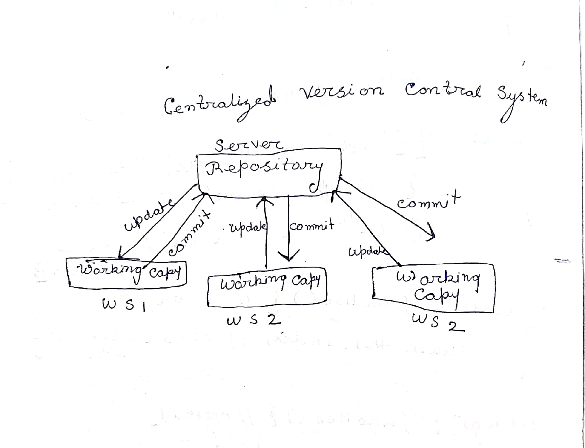
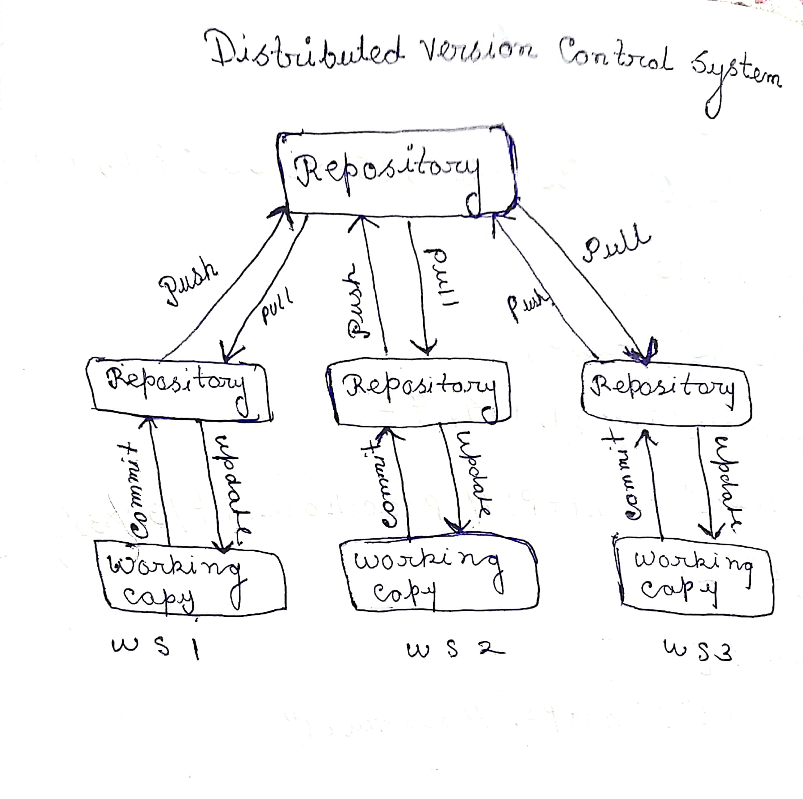

## Introduction of Git 

### Git -> Version Control System 

 * Git Is a version control .It is a software use to tack the local file  

*  gitlab and gitlub are Remote code repository where all other devsloper push there git initiallized local repo . And with the help of github and git lab devlopers can work collaborately 

 
 * git basically work on 3 stages first step is working stage where we can locally modified our codes after that we use "git add" so aur codes goses from working area to stagging area . In stagging area final commit done last step is push where we push our folder to remote repo </pgit>

 * if we wants to gets any update or if our team menbers  change something on there local repository and push it to remote repository now next dayt if i am working on the same project first thing i have to do that is   git clone so that all the latest commit and updates  are fetch to my local repo 

 * Git is a <b>Distributed Version Control System </b>
which basically means that Git helps us when we mess up our code and
forget what needs to be undone to restore the code as it was, before getting
messed up by me.

 
 * git bascially  trackes of the histrory and current  changes
        

### Difference  between Centralized Version Control and Distributed Version Control

|Centralized Version Control|Distributed Version Control|
|---|---|
| in CVS  all the projects , files and directory  are in remote server so the time of cloning we can clone only that files  which we are working entire project can't clone and merge to our remote server only the working file will clone| in DVS entire project will clone  from  remote server to local server no matter if we are working on that files or not it will clone entire project  so the benefits is that we have other source code  in our local repo and check the compatibilitys |
| suppose in online or in remote repo  there is a flipcart project  inside that we have thousand js file , html files among this "A" is working on login.js file so that time of cloning if it is CVS then  in local repo login.js will clone | suppose in online or in remote repo  there is a flipcart project  inside that we have thousand js file , html files among this "A" is working on login.js file so that time of cloning if it is DVS then  in local repo entire flipcart project will clone "A" user gets the other js like  tanscation.js , product.js etc|
| in CVS if client "A" and client "B" both are working on same js file , both are working on "product.js" "A" and "B" both makes some changes  and push them into remote repo  now problem which create it will show the changes of the last person who push in remote  if "B" push last then "B" changes will show  "A" change will ommite  it is happen because of rase condition | in DVS if client "A" and client "B" both are working on same js file , both are working on "product.js" "A" and "B" both makes some changes  and push them into remote repo  now DVS is more Advance suppose "A" client push first  and after fraction of second if "B" wants to push this if will shows us warining to pull first so in our local repo all the changes of previos clients will come first now at the time of merge there is some confilt which asked "B" that do you want the income change if B select yes then "A" change or "A" code will be there and "B" code added after that we can push |
|if CVS  Remote server down developes can't work | in DVS if remote server slow developer can work as developer have entire source code in local system

---
## Basic Git commands
 - <b> git init -> </b> create a new git repository
        
    -  $ mkdir git _lesson 
            $ cd git_lesson
            $ git init // git intialization 

- <b> git status :- </b>Display the status of working directory , with the help of this commands we can fiind the changes, if any change happen in local repository where we initiallized we can track this with the help of git status .Display state of working and staging area  .
           
- <b> git add :- </b>  Adds the change to file to staging area for commit 
       
  -   git add abc // changes are tracked but it should be stored in local repository , to do so commit is done 

- <b> git commit :- </b>  All changes are recorded and store safely to local repository .

  -  $ git commit -m " initial commit " // -m is message tag and " initial commit" is   display message 

        
- <b>git branch :- </b> 
 * git branch commands is used to create a branching .

  
 * It will show us that which branch  currently we are . basically it will shows us default branch name which is 'master' branch where last commit is done .
 
  
 * branch pointer pints to latest commit 
  
 * now if we want to create a new branch from Master branch .

  
 * now if we want to create a new branch from master branch .

  
 * git branch feature [branch name] 

- <b> git checkout:- </b>  if we want to move our pointer from master branch to feature branch then we used this command .Switch the branch to given branch 
 
   - 
git checkout feature 

          
master 

          * feature

        
- <b>git fetch :- </b> latest difications in remote Repository are informed to local  repository. get the changes  from origin server. 
- <b> git pull ;- </b>  local repository picks up the changes from remote repository and integrates it. get the changes  from origin server and merge into current server    
     * git pull origin master  // all chsnges from remote repository are pulled and intigrate to local repository 
 - <b> git log:- </b> it shows  where the head pointer is now pointing 
 - <b> git diff :- </b> After commit if any updation done on local or Remote Repo  "<i> gitt diff </i> "commands show that diff that how many line uploads or delete 
 
 - <b> git reset :- </b> undo the changes .
         
    -  
$ touch newfile1

          
$ git add newfile1 

          
 $ git status -> newfile is indicated as file yet to be committed 

          
 $ git reset

          
 $ git status -> newfile1 is indicated as untracked file yet to be added to staging area .
- <b>git clone :- </b> Create a local working copy of remote repo 
- <b> git  stash :- </b> Save the current change in local repo managed internally by git 

  - git stash
  - git stash pop 
  - git stash list 

- <b>git show :- </b>  show the changes of latest commit 

    - git show <commit-id> => show the changes of that commit 

- <b> git config :- </b>  set the user config in global  config and local config .
 - <b> git push :- </b> push the commit history to remote origin server 
      
      - git push origin <master(branchname)>
## CVS

## DVS
  
