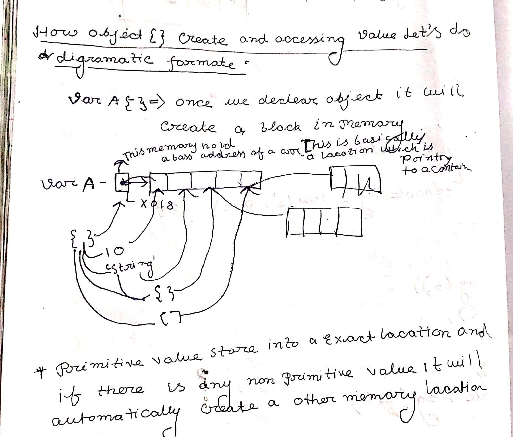

## Copy By reference :-
 </p>In copy by reference specially object amd array we pass  , and we pass there reference so if any changes happen it will effect the whole code .</p>
 
|<B> FEW EXAMPLES OF CPR</b>|
|---|
```JavaScript
 Example 1:-
    var stack ={
        node: 1,
        php: 1,
        go : 1,
        es :[5,6,7,8,9,10]
    }
    Var tech = stack; //var tech = stack its means stack is a object and var tech hold the reference of stack object if we update something on "tech" ,"stack" will automaticaly update   
    tech.go =10;
    tech.es [4]="ES5";
    stack.node ="14.4";
    console.log (1,stack);
    console.log (2,tech
    )
/* OUTPUTE
(1, node:14.4, php :1 , go : 1, es[5,6,7,8,"ES5",9,10])
(2, node:14.4, php :1 , go : 1, es[5,6,7,8,"ES5",9,10]) */

Example 2:-
var stack ={
        node: 1,
        php: 1,
        go : 1,
        es :[5,6,7,8,9,10]
    }
var cloud =
{
    aws :1,
    google: 1,
    do : 1
}
var tech =stack;
var Provider = cloud ;
cloud.js =stack.es ; // cloud .js is a new key in clod object which hold only the reference of stack.es not entire "stack" object
stack.node =
{
    aws : cloud.aws // aws is a key which holds a value of cloud.aws and in stack node is a key which hold a object which has aws key 
}
cloud.js[3] ="Arrow";
console.log (4,stack ,provider);
 /* OUTPUT 2:-
 (4{node : {aws:1},php:1,go:1,es: [5,6,7,"Arrow",9,10])
 {aws:1, google:1,do:1,js[5,6,7,"Arrow",9,10]} */


Example 3:-
    Var stack =
    {
        node : 1,
        php : 1,
        go : 1,
        es : [5,6,7,8,9,10]
    }
    var cloud =
    {
        aws : 1,
        google : 1,
        do :1
    }
    stack ["node"]{
        cloud : stack .es
    }
console.log (1, stack)
/* OUTPUTE 3:-
{
    node : {cloud[5,6,7,8,9,10],}
    php:1,
    go:1,
    es [5,6,7,8,9,10]
    
}
*/
Example 4:-
var stack ={
    node : 1,
    php : 1,
    go : 1,
    es :[5,6,7,8,9,10]
}
var cloud =
{
    aws : 1,
    google : 1,
    do :1
}
stack ["node"] =
{
    cloud : stack.es
}
stack.es[3]="Hello";
stack.node.cloud[4]="world";
console.log(1,stack)
/* Outpute 4:-
{
 node :{ cloud ;[5,6,7,"Hello","World",10]}
 php:1,
 go : 1 ,
 es :[5,6,7,"Hello","world",10]
 } */
 ```

  ## Some pictorial Representation of Copy By Reference :-



